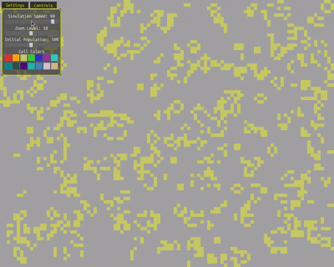

# Conway's Game of Life (Python / Pygame-ce)

A work-in-progress implementation of **Conway’s Game of Life**, built in Python using **Pygame-ce**.




This project started as a relatively simple simulation, based on a [tutorial by Tech With Tim](https://www.youtube.com/watch?v=YDKuknw9WGs), but has grown into an exploration of:

- UI controls
- Interactive settings
- Input handling
- Code organization and refactoring

The goal is not just to recreate the Game of Life, but to **practice ownership over a larger codebase** and experiment with features as ideas come up.

---

## Features

### Core Simulation
- Conway’s Game of Life rules
- Click-and-drag to draw live cells
- Right-click to erase cells
- Pause / resume simulation
- Clear grid
- Randomized starting population

### Settings Menu
- **Zoom level** (grid cell size)
- **Simulation speed**
- **Initial population percentage**
- Toggle grid visibility
- Mouse wheel support for adjusting sliders

### Input & Controls
- Mouse drawing on the grid
- Scroll wheel zooming
- Scroll wheel adjustment of sliders when hovering
- Keyboard shortcuts for common actions

### Visuals
- Grid overlay (toggleable)
- Customizable cell colors
- Simple, clean UI designed for clarity

---

## Controls

| Action | Input |
|------|------|
| Pause / Resume | `Space` |
| Clear grid | `C` |
| Randomize cells | `R` |
| Toggle grid | `G` |
| Draw cells | Left mouse button |
| Erase cells | Right mouse button |
| Zoom | Mouse wheel |
| Open settings | Settings button |

---

## Project Structure

```
├── main.py                # Main game loop and event handling  
├── simulation.py          # Game of Life logic  
├── view.py                # Rendering logic  
├── settingsmenu.py        # Settings UI and sliders  
├── controlsmenu.py        # Controls / help menu  
├── slider.py              # Reusable slider component  
├── constants.py           # Shared constants
```


---

## Why This Project Exists

This project is intentionally **iterative and experimental**.

Instead of following a strict tutorial, features are added based on questions like:
>What if I add this?

>How would I make this feel better to use?

>Where does this logic actually belong?


Refactoring has been an expected and encouraged part of the process.

---

## Known Rough Edges / TODO

- SettingsMenu cleanup and refactoring
- Reduce complexity in event handling
- Improve slider architecture
- Visual polish (transitions, fading cells, etc.)
- Possible performance optimizations for large grids

---

## Requirements

- Python 3.10+
- Pygame / Pygame-ce

Install dependencies:
```bash
pip install pygame-ce
```
Run the simulation:
```
python main.py
```

## Status

**Work in Progress**

This project is actively being tinkered with.  
Expect frequent refactors, experiments, and occasional breakage.